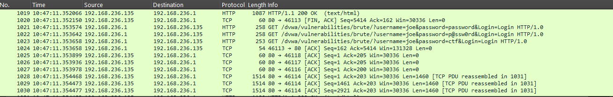
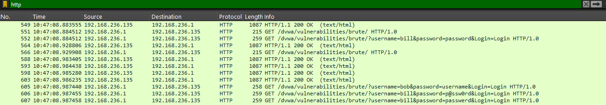
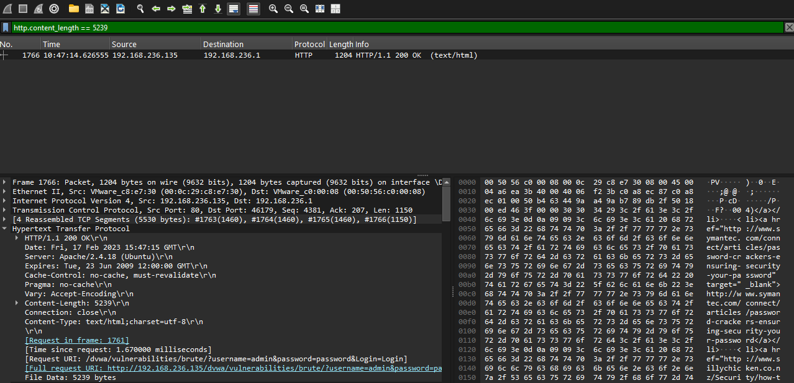

# DVWA Brute Force Analysis
Tools: Wireshark

Vulnerability Class: Credential Brute Force

Environment: Damn Vulnerable Web Application (DVWA)

## Overview
Analyzed a network capture of an active brute force attack against a DVWA 
login page. Identified the attack pattern through HTTP traffic analysis, 
enumerated the credential wordlist used, and determined the successful 
credential combination through HTTP response size comparison.

## Attack Breakdown

### 1. Traffic Overview

The capture contains TCP and HTTP traffic between the attacker (192.168.236.1) 
and the vulnerable web server (192.168.236.135). The mix of HTTP GET requests 
and TCP acknowledgements is characteristic of rapid automated login attempts. 
Applying an `http` display filter isolates the relevant credential submissions.

### 2. Brute Force Pattern

The attacker submitted 180 GET requests to `/dvwa/vulnerabilities/brute/` 
passing credentials directly in the URL: `/dvwa/vulnerabilities/brute/?username=admin&password=password&Login=Login`

Nine usernames were targeted: `alice`, `bill`, `bob`, `joe`, `ctf`, `trudy`, 
`admin`, `administrator`, and `root`, each paired against a wordlist of common 
passwords. Credentials were transmitted in plaintext over HTTP with no 
encryption, making them fully visible in the capture.

### 3. Identifying the Successful Login

All failed login attempts returned a Content-Length of either 5,122 or 5,174 
bytes. Filtering for `http.content_length == 5239` isolates a single outlier 
response — a larger page indicating the server returned a success page rather 
than an error. The corresponding request confirms the valid credentials:

`username=admin / password=password`

The Request URI field visible in the packet details confirms the exact 
submission that triggered the successful response.

## Detection & Prevention
- Detection: Alert on rapid successive GET requests to login endpoints from 
  a single source IP; flag credentials passed in plaintext URLs as they 
  are logged in server access logs and browser history
- Prevention: Account lockout after repeated failed attempts, rate limiting, 
  CAPTCHA, use of POST instead of GET for credential submission, HTTPS to 
  prevent plaintext credential exposure
