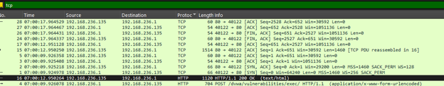
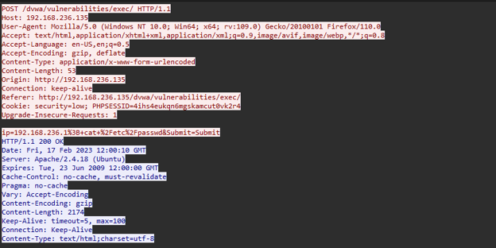
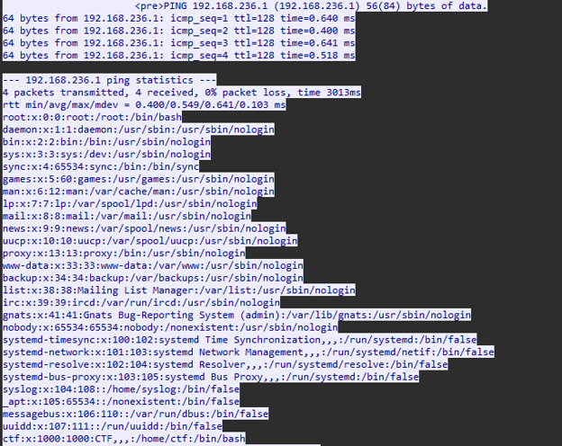

# DVWA Command Injection Analysis

Tools: Wireshark  

Vulnerability Class: OS Command Injection 

Environment: Damn Vulnerable Web Application (DVWA)

## Overview
Analyzed a network capture of an active command injection attack against a 
DVWA instance. Identified the malicious HTTP request, decoded the injected 
payload, and reconstructed the server's response showing successful 
credential file exfiltration.

## Attack Breakdown

### 1. Traffic Overview

The capture contains TCP, HTTP, ICMP, and SSDP traffic. The attacker 
(192.168.236.1) communicates with the vulnerable web server (192.168.236.135). 
Filtering by TCP isolates the relevant HTTP session.

### 2. Malicious HTTP Request

The attacker submitted a POST request to `/dvwa/vulnerabilities/exec/` with 
the following payload:

ip=192.168.236.1%3B+cat+%2Fetc%2Fpasswd

Decoded: `192.168.236.1; cat /etc/passwd`

The `%3B` is a URL-encoded semicolon, used to chain a second OS command 
after the legitimate ping. The application passed this input directly to 
the shell without sanitization.

### 3. Successful Exfiltration

The server returned a 200 OK containing the full `/etc/passwd` file embedded 
in the HTTP response body. The presence of `ctf:x:1000:1000` confirms the 
target system. The attacker now has a complete list of system users for 
further attacks such as brute force or privilege escalation.

## Detection & Prevention
- Detection: Alert on POST bodies containing `;`, `|`, or `&&` to 
  sensitive endpoints
- Prevention: Input validation (whitelist IPs only), use of safe APIs 
  instead of shell execution, Web Application Firewall rules
